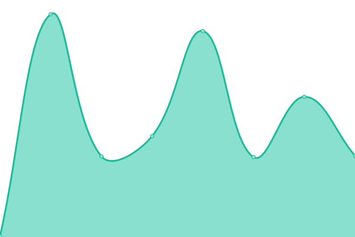
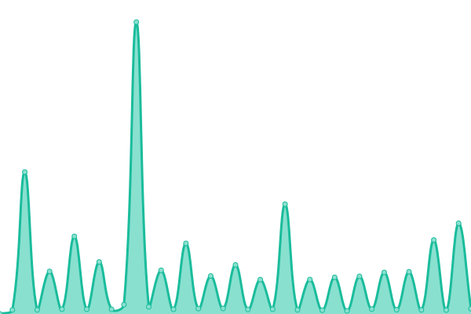
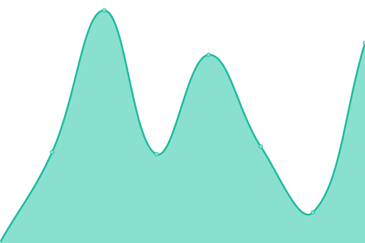

# [📈 Live Status](https://demo.upptime.js.org): <!--live status--> **🟧 Partial outage**

This repository contains the open-source uptime monitor and status page for [m-gic](https://demo.upptime.js.org), powered by [Upptime](https://github.com/upptime/upptime).

With [Upptime](https://upptime.js.org), you can get your own unlimited and free uptime monitor and status page, powered entirely by a GitHub repository. We use [Issues](https://github.com/m-gic/upptime/issues) as incident reports, [Actions](https://github.com/m-gic/upptime/actions) as uptime monitors, and [Pages](https://demo.upptime.js.org) for the status page.

<!--start: status pages-->
<!-- This summary is generated by Upptime (https://github.com/upptime/upptime) -->
<!-- Do not edit this manually, your changes will be overwritten -->
<!-- prettier-ignore -->
| URL | Status | History | Response Time | Uptime |
| --- | ------ | ------- | ------------- | ------ |
|  [Openlist](https://ma-ic-openlist.hf.space) | 🟥 Down | [openlist.yml](https://github.com/m-gic/upptime/commits/HEAD/history/openlist.yml) | 

 760ms
     
 | 

<a href="https://m-gic.github.io/upptime/history/openlist">100.00%</a>
    

|  [Firefox](https://m-gic-firefox.hf.space/) | 🟥 Down | [firefox.yml](https://github.com/m-gic/upptime/commits/HEAD/history/firefox.yml) | 

 195ms
     
 | 

<a href="https://m-gic.github.io/upptime/history/firefox">100.00%</a>
    

|  [Koyeb](https://living-costanza-vinxqo-b35b7828.koyeb.app) | 🟩 Up | [koyeb.yml](https://github.com/m-gic/upptime/commits/HEAD/history/koyeb.yml) | 

 822ms
     
 | 

<a href="https://m-gic.github.io/upptime/history/koyeb">100.00%</a>
    

|  [Uptime-Kuma](https://ma-ic-uptime.hf.space) | 🟩 Up | [uptime-kuma.yml](https://github.com/m-gic/upptime/commits/HEAD/history/uptime-kuma.yml) | 

 222ms
     
 | 

<a href="https://m-gic.github.io/upptime/history/uptime-kuma">100.00%</a>
    

<!--end: status pages-->

[**Visit our status website →**](https://demo.upptime.js.org)

## 📄 License

- Powered by: [Upptime](https://github.com/upptime/upptime)
- Code: [MIT](./LICENSE) © [Anand Chowdhary](https://anandchowdhary.com), supported by [Pabio](https://pabio.com)
- Data in the `./history` directory: [Open Database License](https://opendatacommons.org/licenses/odbl/1-0/)
